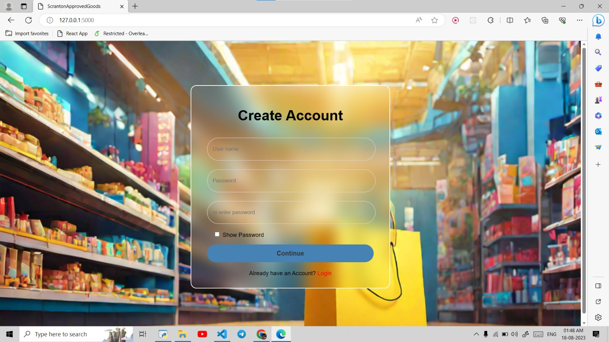

# Personalised Product Recommendation

The system provides users with tailored product suggestions based on their preferences and browsing behavior. It's designed to enhance user engagement and drive sales by offering relevant and appealing product recommendations.


## Table of Contents

 - [Features](https://github.com/Unknownempire/UnknownFlip#features)
 - [Snapshots](https://github.com/Unknownempire/UnknownFlip#screenshots)
 - [Installation](https://github.com/Unknownempire/UnknownFlip#installation)
 - [Usage](https://github.com/Unknownempire/UnknownFlip#usage)
 - [Technologies](https://github.com/Unknownempire/UnknownFlip#technologies)
 - [Contributing](https://github.com/Unknownempire/UnknownFlip#contributing)
 - [Contact](https://github.com/Unknownempire/UnknownFlip#contact-us)


## Features

- User Registration and Login: Users can create accounts and log in to the system.
- Browsing Behavior Tracking: The system tracks user behavior, such as viewed products and purchase history.
- Personalized Recommendations: Based on user preferences and browsing behavior, the system generates personalized product recommendations.
- Interactive Web Interface: A user-friendly web interface where users can view and interact with recommended products.
- Flask Backend: Backend implemented using Flask, allowing for easy communication between frontend and recommendation algorithms.


## Screenshots




## Installation

To use this project, follow the steps below:

Initialise git on your terminal.

```bash
  git init
```
    
Clone this repository to your local machine:
```bash
  git clone https://github.com/Unknownempire/UnknownFlip
  cd UnknownFlip
```
Set up a virtual environment (recommended) and install dependencies:
```bash
  python -m venv venv
  source venv/bin/activate   # On Windows: venv\Scripts\activate
  pip install -r requirements.txt

```
Run the application:
```bash
  python app.py
```

Voila! Your application starts working.

Access the application by navigating to http://localhost:5000 in your web browser.

## Usage

- Register an account or log in using existing credentials.
- Set your preferences (favorite categories, brands, etc.) to improve the quality of recommendations.
- Browse through the recommended products on your personalized dashboard.
- Interact with the products, view details, and make purchases.


## Tech Stack

**Client:** Javascript, HTML, CSS

**Server:** Python, Flask(Python web framework)

- Machine Learning algorithms (for generating recommendations)
## Contributing

Contributions are always welcome!

If you have any suggestions, bug reports, or improvements, please open an issue or submit a pull request.

Please adhere to this project's `code of conduct`.


## Contact Us

- [@PranavChaudhary](https://github.com/Unknownempire)
- [@SakshamJain](https://github.com/Skshmjn2)
- [@ParthKumar](https://github.com/Parthkumar507)
